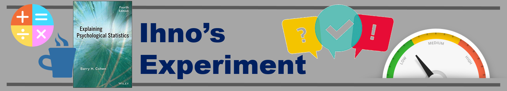

# Example: Ihno's Dataset





```r
library(tidyverse)       # super helpful everything!
library(haven)           # inporting SPSS, SAS, & Stata data files
library(furniture)       # nice tables of descriptives
```


## Background of Data

<div class="rmdlink">
<p><span class="citation">@epse4</span>: has made the data from his textbook “Explaining Spychological Statistics, 4th edition” available on his <a href="http://www.psych.nyu.edu/cohen/EPS4e.html">website</a></p>
</div>


 The data come from a *hypothetical* study performed by **Ihno** *(pronounced “Eee-know”)*, an advanced doctoral student, who was the teaching assistant (TA) for several sections of a statistics course. The **100 participants** in the data set are the students who were enrolled in Ihno’s sections, and voluntarily consented to be in her study, which was approved by the appropriate review board at her hypothetical school. Her data were collected on two different days. On the <U+FB01>rst day of classes, the students who came to one of Ihno’s sections <U+FB01>lled in a brief **background questionnaire** on which they provided contact information, some qualitative data (`gender`, undergrad `major`, why they had enrolled in statistics (`reason`), and whether they have a habit of drinking `coffee`), and some quantitative data (number of math courses already completed (`prevmath`), the score they received on a diagnostic math background quiz they were all required to take before registering for statistics `mathquiz`, and a rating of their math `phobia` on a scale from 0 to 10). You will see that, due to late registration and other factors, not all of Ihno’s students took the diagnostic math background quiz.

 The rest of Ihno’s data were collected as part of an **experiment** that she conducted during her recitation sessions on one day in the middle of the semester. (The one exception is that her students took a regular 10 question quiz the week before her experiment (`statquiz`), and she decided to add those scores to her data set.) At the beginning of the experiment, Ihno explained how each student could take his or her own pulse. She then provided a half-minute interval during which they counted the number of beats, and then wrote down twice that number as their heart rate (`hr_base`) in beats per minute (bpm). Then, each student reported how many cups of coffee they had consumed since waking up that morning (`num_cups`), and <U+FB01>lled out an anxiety questionnaire consisting of 10 items, each rated (0 to 4) on a 5-point Likertscale. Total scores could range from 0 to 40, and provided a measure of baseline anxiety (`anx_base`). 

 Next, Ihno announced a pop quiz. She handed out a page containing 11 multiple-choice statistics questions on material covered during the preceding two weeks, and asked the students to keep this page face down while taking and recording their  pulse (`hr_pre`) and <U+FB01>lling out a anxiety questionnaire (`anx_pre`). Then Ihno told the students they had 15 minutes to take the fairly dif<U+FB01>cult quiz. She also told them that the <U+FB01>rst 10 questions were worth 1 point each but that the 11th question was worth 3 points of extra credit. Ihno’s experimental manipulation consisted of varying the dif<U+FB01>culty of the 11th question. Twenty-<U+FB01>ve quizzes were distributed at each level of dif<U+FB01>culty of the <U+FB01>nal question: easy, moderate, dif<U+FB01>cult, and impossible to solve (`exp_cond`). After the quizzes were collected, Ihno asked the students to provide heart rate and anxiety data one more time (`hr_post`, `anx_post`). Finally, Ihno explained the experiment, adding that the 11th quiz question would not be scored and that, although the students would get back their quizzes with their score for the <U+FB01>rst 10 items (`statquiz`), that score would not in<U+FB02>uence their grade for the statistics course.
 
 
<div class="rmdlightbulb">
<p>You can use a file’s <strong>link</strong> to read data directly off a website!</p>
</div>


